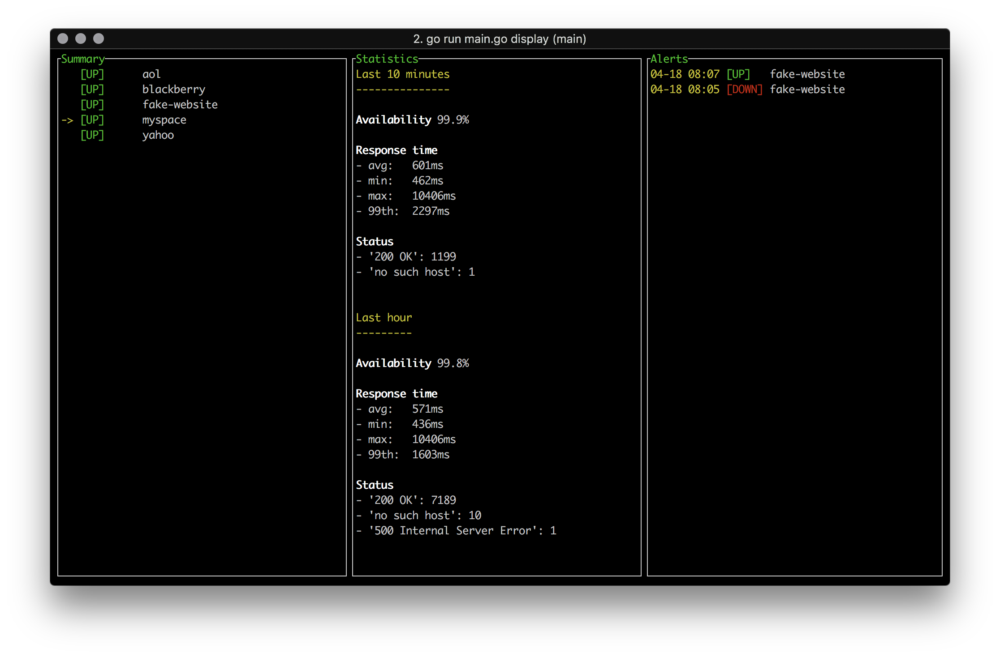

# Observer

Observer is a simple CLI website monitoring tool.



## Architecture

This project has 4 distinct concerns:

- fetching raw metrics by polling websites
- processing those raw metrics and computing more interesting metrics (such as average/min/max/percentile over different periods of time) and alerts
- storing those metrics and alerts
- displaying those metrics and alerts

Thus, this tool is separated into 4 parts, one for each concern:

- *fetch*: custom CLI tool (`observer fetch`, related code is in the `fetch` sub-package)
- *process*: custom CLI tool (`observer process`, related code is in the `process` sub-package)
- *store*: influxDB, as it is a database designed specifically for this use case (storing metrics)
- *display*: custom CLI tool (`observer display`, related code is in the `display` sub-package)

The `util` sub-package contains code that is used by several of the others sub-packages.

## Running this project

This project is written in Go and uses [dep](https://github.com/golang/dep) as its dependency manager.

It has been tested on macOS (10.13.4) (and quickly on ArchLinux).

To compile the source code, you'll need to install Go (tested using go 1.10.1) and dep (v0.4.1+).

You will need to run influxDB, either by installing it directly on your machine or by running it in a container. To start an influxDB database using Docker, you can run these commands:

```bash
docker pull influxdb

docker run \
  --name observer \
  --publish 8086:8086 \
  --volume $(pwd)/__influxdb/:/var/lib/influxdb/ \
  --env INFLUXDB_DB=observer \
  influxdb
```

It creates an empty influxDB instance with authentication disabled (fine for testing), which uses `./__influxdb/` as its persistent storage folder.

This project doesn't handle the deletion of old metrics and leave this task to influxDB. To keep only the last week of data, you can create a new influxDB retention policy and configure this project to use it.

To run this project manually, it is required to run each module in its own shell. This project does not provide any way to daemonize the fetch and process processes (in production, those processes should run in the background and be managed by a service manager such as systemd, and the same thing applies to the influxDB database).

You can easily download and compile this project and its dependencies by runnning the following commands:

```bash
# clone repository
git clone https://github.com/puigfp/observer.git

cd observer

# download dependencies in the right versions to vendor/
dep ensure

# compile project
go build
```

Copy the `config.template.json` to a brand new `config.json` and choose some websites to monitor.

Run these 3 commands in the same folder:

Fetch:

```bash
./observer fetch
```

Process:

```bash
./observer process
```

Display:

```bash
./observer display
```

## Running the tests

```bash
go test
```

## InfluxDB database structure

- `metrics`

  cf. [fetch sub-package type declarations](fetch/type.go)

  - tags

    - timestamp

    - website

  - fields

    - responseTime: int

    - status: string

    - statusCode: int

    - success: true

- `metrics_2m`, `metrics_10m`, `metrics_1h`

  - tags

    - timestamp

    - website

  - fields

    - responseTime_avg: float

    - responseTime_min: int

    - responseTime_max: int

    - responseTime_99thPercentile: int

    - statuts_counts: string

      JSON formatted string representing a 'status string' -> 'count' map

    - success_false_count: int

    - success_true_count: int

- `alerts`

  - tags

    - timestamp

    - website

  - fields

    - status: bool

## Improvements

- possible implementation improvements

  - The 3 commands use the same configuration file format

    - the `process` command doesn't need the websites list to work

    - the `display` command should not read the websites list from the configuration file, but instead fetch it using a call to the back-end

    - -> there should be 3 configuration file formats, one for each module

  - Better handling of the `net/http` error messages categorization.

  - Better handling of errors that can happen in the displaying part, the current ui does not show any error message if something goes wrong, and instead only shows "NO DATA" in place of the metrics.

- possible design improvements

  - Change how the data processing is done. In this implementation, the processor polls the database regularily to process the metrics of the last window. If the processor is down during a small period of time and then is back up, it won't process the data it missed.

  - Better dashboard refresh flow, to allow each piece of information to be refreshed at its own rate. In the current implementation the dashboard refreshes all the data it shows every 10 seconds (websites statuses, metrics over 10m and 1h window, alerts), making a lot of useless db API calls given that some data only changes every minute. One solution could be to allow the information to be pushed by the back-end to the dashboard (using websockets for example).
