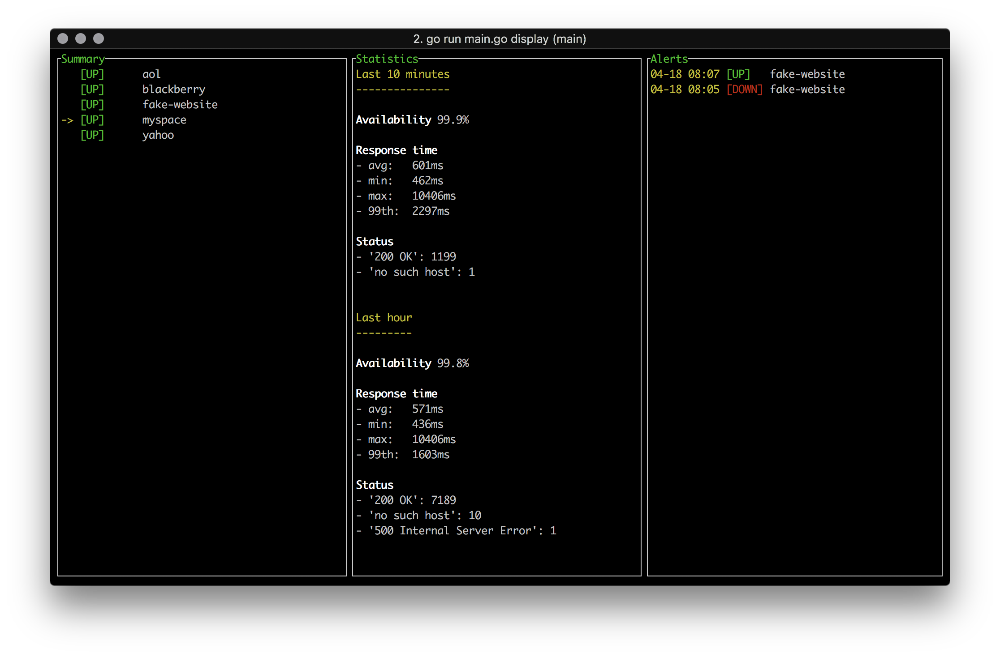

# observer/display

This sub-package contains all the functions related to the fourth concern: *displaying those metrics/alerts*

## General Design

The whole state of the UI (metrics, alerts, selected website) is stored in a single variable.

This state variable can be locked for safe read/modification.

To update the UI, we use functions that can compute the 3 widgets (summary, statistics and alerts) from the state.

To fully update the state and then the UI, one should:

- lock the state

- update the state

- refresh the widgets

- unlock the state

- trigger an UI rendering

## Detailed design

This package exports a CLI command object. When this command is launched:

- the configuration file is read and parsed

- the UI and state are initialized

- a background goroutine is launched to poll regularily the database for the last metrics

- some event handlers are binded to the up, down and q keypresses

## Folder structure

    display
    ├── README.md   // this file
    ├── cmd.go      // "main" file
    ├── events.go   // keypresses listeners
    ├── fetch.go    // metrics fetch from influxDB
    ├── render.go   // UI init + UI render trigger
    ├── state.go    // state init
    ├── type.go     // type declarations
    └── widgets.go  // state -> widgets functions
